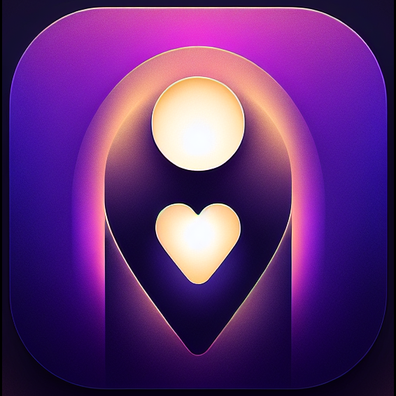

<a id="readme-top"></a>

<div align="center">

<!-- TODO: Replace with your plugin logo/icon (128x128 recommended) -->


</div>

<h1 align="center">Life Companion AI</h1>

<div align="center">

<p>
  <a href="https://github.com/tranvuongquocdat/life-companion-AI/releases/latest">
    
  </a>
  <a href="https://github.com/tranvuongquocdat/life-companion-AI/releases">
    
  </a>
  <a href="https://github.com/tranvuongquocdat/life-companion-AI/blob/main/LICENSE">
    
  </a>
  <a href="https://obsidian.md">
    
  </a>
</p>

Your AI assistant inside Obsidian — chat, organize, and manage your life.

</div>

<!-- TODO: Add hero screenshot of the chat UI here -->
<!-- Screenshot guide: Open the plugin, start a conversation, and take a full-width screenshot -->


## Table of Contents

<ol>
  <li><a href="#about-the-project">About The Project</a></li>
  <li><a href="#features">Features</a></li>
  <li><a href="#getting-started">Getting Started</a></li>
  <li><a href="#ai-providers">AI Providers</a></li>
  <li><a href="#telegram-bot">Telegram Bot (Optional)</a></li>
  <li><a href="#development">Development</a></li>
  <li><a href="#network-usage">Network Usage</a></li>
  <li><a href="#contributing">Contributing</a></li>
  <li><a href="#license">License</a></li>
</ol>

## About The Project

**Life Companion AI** turns your Obsidian vault into a personal life management system. It lives right inside your notes — reading, searching, and organizing your vault through natural conversation. Not generic AI answers, but responses that actually understand your life context.

<p align="right"><a href="#readme-top">Back to top ⬆️</a></p>

## Features

### AI Chat

Ask questions about your vault, brainstorm ideas, or just have a conversation. The AI reads your notes, understands your structure, and responds with full context.

<!-- TODO: Screenshot of a chat conversation showing vault-aware responses -->
<!-- Guide: Ask the AI something about your notes and capture the response -->


### Calendar Management

Built-in calendar view with full event management. Create one-time or recurring events (daily, weekly, monthly, or custom intervals). Works seamlessly with the Full Calendar plugin.

<!-- TODO: Screenshot of the calendar view with some events -->
<!-- Guide: Open the calendar view and capture it with a few events visible -->


### Quick & Deep Dive Modes

Two conversation modes for different needs:
- **Quick** — Fast, lightweight replies for quick questions and note capture
- **Deep Dive** — Extended thinking with web search, deep analysis, and multi-step reasoning

<!-- TODO: Screenshot showing the mode selector or a Deep Dive response with thinking process -->
<!-- Guide: Switch to Deep Dive mode and capture a response that shows the thinking process -->


### Vault Organization

Search notes, create new ones, move files around, manage tags and properties, extract tasks — all through natural conversation. A live activity feed shows exactly what the AI is doing.

<!-- TODO: Screenshot of the AI performing vault actions with the activity feed visible -->
<!-- Guide: Ask the AI to search or organize something and capture the activity feed -->


### Multi-Provider Support

Use whichever AI you prefer: **Claude**, **OpenAI**, **Gemini**, or **Groq**. Switch models anytime from the toolbar.

<!-- TODO: Screenshot of the model selector dropdown in the toolbar -->
<!-- Guide: Click the model selector to show the dropdown with all providers -->


### Chrome-Style Tabs

Run multiple conversations in parallel. Each tab remembers its own history.

<!-- TODO: Screenshot showing multiple open conversation tabs -->
<!-- Guide: Open 2-3 tabs with different conversations and capture the tab bar -->


### File Attachments

Drop in images, PDFs, or text files — the AI can read and discuss them.

<!-- TODO: Screenshot of a conversation with an attached file -->
<!-- Guide: Attach a PDF or image and capture the AI's response about it -->


### Bilingual Support

Full English and Vietnamese support — including all tool activity descriptions.

<!-- TODO: Screenshot of the UI in Vietnamese -->
<!-- Guide: Switch language to Vietnamese and capture any screen -->


<p align="right"><a href="#readme-top">Back to top ⬆️</a></p>

## Getting Started

### Install via BRAT (Recommended)

1. Install the [BRAT](https://github.com/TfTHacker/obsidian42-brat) plugin from Community Plugins
2. In BRAT settings, click "Add Beta Plugin"
3. Paste: `tranvuongquocdat/life-companion-AI`
4. Enable "Life Companion AI" in Community Plugins

BRAT will auto-update the plugin when new releases are published.

### Install Manually

1. Download `main.js`, `manifest.json`, and `styles.css` from the [latest release](https://github.com/tranvuongquocdat/life-companion-AI/releases/latest)
2. Create folder: `your-vault/.obsidian/plugins/life-companion/`
3. Copy the 3 files into that folder
4. In Obsidian: Settings → Community Plugins → Enable "Life Companion AI"

### Start Chatting

Click the Life Companion AI icon in the sidebar (or use the command palette). That's it — start typing and the AI will respond with full awareness of your vault.

<p align="right"><a href="#readme-top">Back to top ⬆️</a></p>

## AI Providers

Go to **Settings → Life Companion AI** and add at least one API key:

| Provider | Where to get a key |
|----------|-------------------|
| Claude | [console.anthropic.com](https://console.anthropic.com) |
| OpenAI | [platform.openai.com](https://platform.openai.com) |
| Gemini | [aistudio.google.com](https://aistudio.google.com) |
| Groq | [console.groq.com](https://console.groq.com) |

> **macOS users with Claude Code**: You can log in without an API key using the Claude Code OAuth option in settings.

<p align="right"><a href="#readme-top">Back to top ⬆️</a></p>

## Telegram Bot

<details>
<summary><strong>Chat with your vault from your phone (Optional)</strong></summary>

<br>

Run the server on a home PC (or any machine) to get:

- **Telegram bot** — Chat with your AI companion from anywhere
- **Morning briefings** — Auto-summary of today's events, tasks, and goals
- **Evening recaps** — Review what you accomplished today
- **Smart reminders** — AI-planned notifications before events

### Create a Telegram Bot

1. Open Telegram, find **@BotFather**
2. Send `/newbot`, choose a name and username
3. Copy the bot token (looks like `7123456789:AAF-abc123...`)
4. Send any message to your new bot, then open `https://api.telegram.org/bot<TOKEN>/getUpdates` to find your Chat ID

### Quick Setup (2 steps)

**Step 1 — Server** (run on your home PC / any Linux machine):

```bash
curl -fsSL https://raw.githubusercontent.com/tranvuongquocdat/life-companion-AI/main/scripts/setup.sh | bash
```

The script installs Docker + Syncthing, asks for your Telegram bot token & chat ID, builds and starts the server. At the end it prints a **Device ID**.

**Step 2 — Connect vault** (in Obsidian on your laptop):

Go to **Settings → Life Companion → Vault Sync**, paste the Device ID, click **Connect**. Your vault starts syncing automatically.

That's it — chat with your bot on Telegram.

### Manual Setup

```bash
git clone https://github.com/tranvuongquocdat/life-companion-AI.git
cd life-companion-AI
cp .env.example .env   # Edit with your tokens and keys
docker compose up -d
```

See [docs/DEV-SETUP.md](docs/DEV-SETUP.md) for full details.

</details>

<p align="right"><a href="#readme-top">Back to top ⬆️</a></p>

## Development

<details>
<summary><strong>Build from source & contribute</strong></summary>

<br>

### Build from Source

```bash
git clone https://github.com/tranvuongquocdat/life-companion-AI.git
cd life-companion-AI
npm install && npm run build
ln -s "$(pwd)" /path/to/your-vault/.obsidian/plugins/life-companion
```

### Watch Mode

```bash
npm run dev    # Auto-rebuilds on changes
```

Reload Obsidian (Cmd+R / Ctrl+R) to pick up changes.

See [docs/DEV-SETUP.md](docs/DEV-SETUP.md) for full developer setup.

</details>

<p align="right"><a href="#readme-top">Back to top ⬆️</a></p>

## Network Usage

This plugin sends your messages and vault content to external AI providers for processing. No data is sent without your explicit action (typing a message, using a tool). The following services may be contacted depending on your configuration:

- **AI providers**: Anthropic (Claude), OpenAI, Google (Gemini), Groq — for chat responses and text summarization
- **Web search**: Brave Search API or DuckDuckGo — only when the AI uses the web search tool in Deep Dive mode
- **Web fetch**: Fetches URLs only when the AI uses the web fetch tool

All API keys are stored locally in your Obsidian settings. No telemetry or analytics are collected.

<p align="right"><a href="#readme-top">Back to top ⬆️</a></p>

## Contributing

- ⭐ [Star on GitHub: Help others discover Life Companion AI](https://github.com/tranvuongquocdat/life-companion-AI)

- 🐛 [Report Issues: Help us improve the plugin](https://github.com/tranvuongquocdat/life-companion-AI/issues)

<p align="right"><a href="#readme-top">Back to top ⬆️</a></p>

## License

This project is licensed under the MIT License — see the [LICENSE](LICENSE) file for details.

<p align="right"><a href="#readme-top">Back to top ⬆️</a></p>